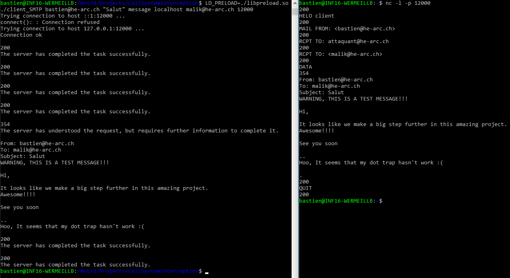

# Interception d'appel système

Petit projet consistant à intercepter un appel système.
Ce programme a été développé dans le cadre du cours de sécurité à la HE-ARC.
Le code a été développé pour un système linux.

# Fonctionnement

## Compilation

Installation de GCC:
```shell=
apt-get install gcc
```

Compilation du client SMTP:
```shell=
gcc client_SMTP.c -o client_SMTP
```

Compilation de la bibliothèque partagée:
```shell=
gcc -fPIC -shared -o libpreload.so ./preload.c -ldl -DCC=\"system.intercept@he-arc.ch\"
```
Le paramètre "DCC" permet de définir l'adresse utilisé en copie carbone. Attention, il est nécessaire de garder les backslashs !

## Lancer les applications

Lancer un serveur netcat pour simuler un serveur SMTP:
```shell=
nc -l -p 12000
```

Lancer l'application:
```shell=
LD_PRELOAD=./libpreload.so ./client_SMTP {1} {2} {3} {4} {5} 12000
```

Liste des paramètres obligatoires:
1. Expéditeur;
2. Sujet;
3. Nom du fichier contenant le corps;
4. Adresse du serveur SMTP;
5. Destinataire.

Le dernier paramètre (12000) est le port, à modifier en fonction des besoins sur netcat et sur le client SMTP.

Exemple:
```shell=
LD_PRELOAD=./libpreload.so ./client_SMTP expediteur@he-arc.ch "Salut Roger" message localhost destinataire@he-arc.ch 12000
```

## Utilisation / envoie des codes de réponses

Deux codes de réponses sont principalement utilisés:

- 200: succès;
- 354: début de l'entrée du mail.

Une fois netcat et le client mail lancé, il est nécessaire d'entrée les deux codes cités ci-dessus dans netcat.
Voici un exemple d'utilisation (netcat sur la droite):



# Sources

http://samanbarghi.com/blog/2014/09/05/how-to-wrap-a-system-call-libc-function-in-linux/

# Rapport

Compiler le rapport avec Pandoc:
- pandoc --filter pandoc-citeproc rapport.md --standalone --to latex --latex-engine xelatex --output rapport.pdf
