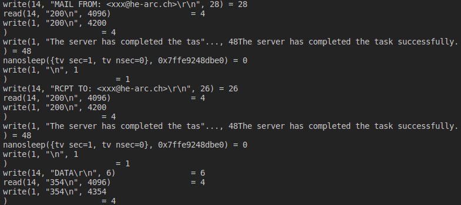
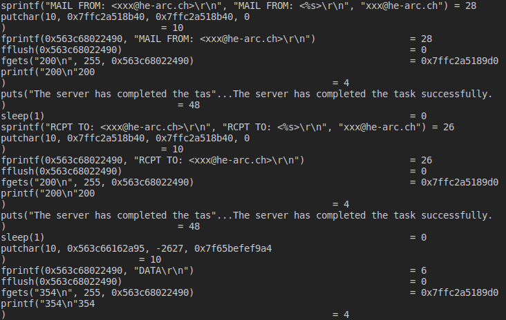

\newpage

\tableofcontents

\newpage

# Introduction

Dans le cadre du cours de sécurité, nous devons réaliser un projet ayant un lien avec le cours.
Une liste de sujets a été proposée par l'enseignant et nous avons choisi le thème suivant:

>Interception d'appels systèmes / d'appels de bibliothèques sous Linux ou Microsoft (p.ex. avec LD_PRELOAD ou SystemTap)

Nous avons eu l'idée d'effectuer une interception d'appel système sur le programme C que nous avons réalisé lors du cours de 1re année qui consistait en un client SMTP. Le but est de pouvoir ajouter une copie carbone au mail envoyé via l'interception d'appel système de ce programme. De cette façon, l'utilisateur n'a pas conscience  que le mail est envoyé en copie à une autre adresse en plus du destinataire.

# Fonctionnement

Notre logique de notre programme est relativement simple, nous interceptons les appels système `fprintf` du client SMTP et si la chaîne passée à `fprintf` contient la chaine `RCPT TO:` alors cela signifie qu'on est en train d'envoyer l'adresse email du destinataire.

Lorsque cet appel est détecté, nous envoyons notre propre ligne avec l'adresse email du pirate :
- `RCPT TO: adresse.pirate@xxx.com`

Puis nous attendons la réponse du serveur avant de finalement envoyer le contenu du `fprintf` intercepté.

# Comment utiliser

La compilation de notre programme nécessite `gcc` et ne fonctionne que sur un système Linux.

## Compilation

La ligne ci-dessous permet de compiler le programme qui intercepte l'appel `fprintf` :

```shell=
gcc -fPIC -shared -o libpreload.so ./preload.c -ldl -DCC=\"malik.fleury@he-arc.ch\"
```

Le dernier paramètre passé permet de définir à qui sera envoyée la copie carbone lors de l'exécution de la bibliothèque partagée.

La ligne suivante permet de compiler le client SMTP pour l'envoi du mail:

```shell=
gcc client_SMTP.c -o client_SMTP
```

## Utilisation

Enfin, pour utiliser le client SMTP avec l'interception d'appel de la fonction `fprintf`:

```shell=
LD_PRELOAD=libpreload.so ./client_SMTP
```

Un exemple d'utilisatin avec un serveur nc se trouve dans le fichier `README.md` à la base du dossier du projet.

# Contre-mesures potentielles

Voici quelques contre mesures qui permettraient de détecter une attaque ou qui implémentées dans notre client TCP permettraient d'empêcher une telle attaque avec notre démonstrateur.

## Test avec un serveur SMTP online ou en localhost

Le client SMTP comporte un paramètre permettant de définir le serveur avec lequel communiquer. Il est ainsi possible de simuler un serveur avec netcat par exemple. La simulation d'un tel serveur pourrait permettre de détecter l'ajout d'une adresse email.

Cependant, le démonstrateur de concept que nous avons implémenté pourrait très bien se désactiver lorsque l'adresse du serveur est `localhost`.

## Envoie des informations caractère par caractère

Notre bibliothèque détecte l'appel système `fprintf` et compare la chaîne de caractères envoyée avec la chaîne `RCPT TO:`. Dans le cas où le client SMTP enverrait ses caractères un à un, alors l'implémentation actuelle ne fonctionnerait pas, car elle ne prend pas en compte les anciens caractères envoyés, mais uniquement ceux présents lors de l'appel de `fprintf`.

## Statistiques sur ses propres appels

Une autre manière qui permettrait de détecter notre attaque serait de faire des statistiques sur le temps de réponse de chaque appel que nous effectuons sur les commandes pour l'envoi de données. Une fois le temps d'exécution mis en relation avec la taille du message envoyé, on pourrait détecter que l'envoie de la première adresse email prend plus de temps que les autres appels.

Attention, il faut également prendre en compte que le serveur smtp peut prendre plus ou moins de temps selon les étapes pour répondre.

## Appels systèmes différents

Lors de la réalisation de ce projet l'étape cruciale a été de trouver le bon appel système, comme expliqué dans le point `Problèmes rencontrés`. Une contre mesure pour cette attaque consisterait à changer d'appels système ou de ne pas utiliser la bibliothèque C standard. Ainsi l'attaquant devra trouver en premier lieu quel appel est utilisé pour pouvoir l'intercepter.

# Tests

Nous avons testé notre programme avec un serveur `nc` en local ainsi qu'avec le serveur smtp de l'école (`smtprel.he-arc.ch`).

Ci-dessous, une capture d'execution avec un serveur `nc` en localhost.


# Problèmes rencontrés

## Interception du bon appel

Afin de trouver l'appel système à intercepter, nous avons tout d'abord essayé d'intercepter directement la commande `puts` cependant cette fonction n'était jamais appelée.

Puis nous avons essayé de lancer notre programme avec la commande `strace` comme suit:

```shell=
strace ./client_SMTP xxx@he-arc.ch "Salut Roger" message localhost xxx@he-arc.ch 12000
```

Qui nous indiquait qu'il fallait intercepter la fonction `write`.



Nous avons ensuite essayé d'intercepter cette fonction write mais sans succès. La technique `LD_Preload` permet d'intercepter des appels système de notre code, mais la bibliothèque standard ne fait pas appel à cette fonction.

Nous avons ensuite utilisé `ltrace` afin de voir les appels y compris de bibliothèques ce qui nous a donné le résultat suivant:



Nous avons ainsi décidé d'intercepter l'appel à la fonction `fprintf`. Cette solution a été la bonne et nous l'avons implémentée.

# Améliorations

Ce projet avait pour but la mise en place d'un démonstrateur permettant de démontrer qu'il est possible via une interception d'appels de modifier le comportement d'un programme.

Notre projet est complet, mais a été limité par le temps à disposition. Voici quelques idées d'améliorations potentielles qui seraient intéressantes d'implémenter.

## SystemTap

Nous avons choisi d'utiliser le système de `LD_PRELOAD` pour ce projet, mais il serait intéressant de développer la même interception d'appels système mais cette fois en utilisant `SystemTap`.

## Statistiques sur les appels système

Notre projet ayant comme but premier de découvrir les interceptions d'appels système, il serait intéressant de faire des statistiques sur les différents appels de programme. Et ensuite, essayer de détecter des programmes dangereux à partir de ces statistiques.

# Conclusion

Ce projet nous a permis de voir comment fonctionnent les appels système et de mettre en place en démonstrateur d'une attaque en utilisant cette technique. Nous avons pris conscience qu'il était relativement simple de modifier le comportement ou de contourner les sécurités d'un programme.

L'interception d'appels systèmes peut être utiliser dans de nombreux cas et nous avons fait qu'effleurer une petite de partie de ce qui est possible de faire.

\newpage

\listoffigures

# Bibliographie

-  http://samanbarghi.com/blog/2014/09/05/how-to-wrap-a-system-call-libc-function-in-linux/, 26 avril 2019, Article sur l'interception d'appels système avec LD_PRELOAD
